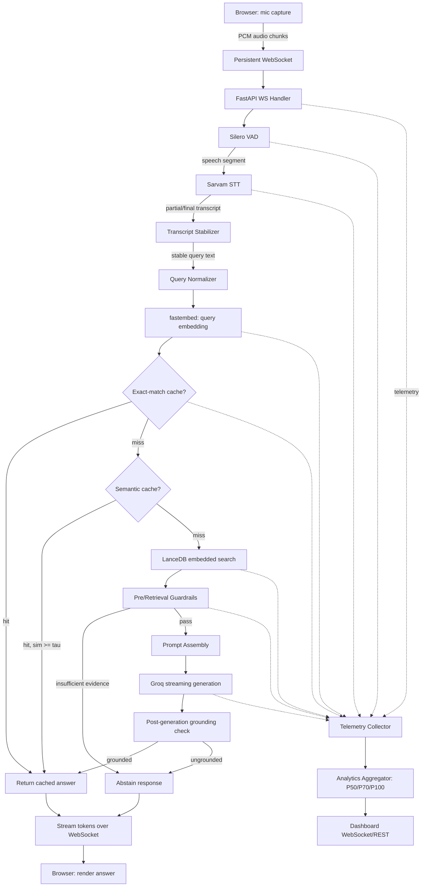
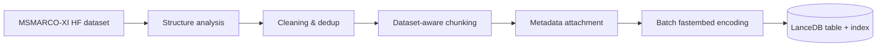
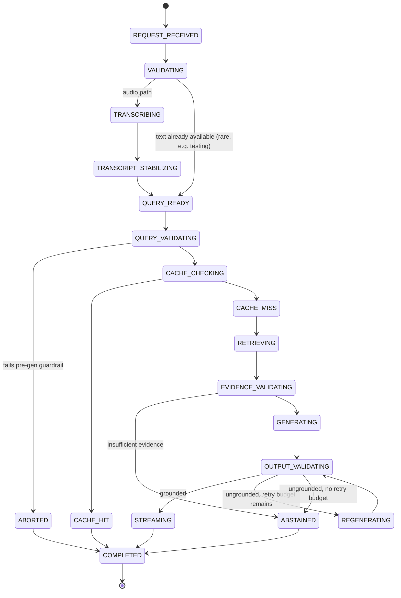

# Technical Requirements Document (TRD)
### Voice-Enabled, Ultra-Low-Latency RAG System — HH Goa 2026, Task 2

**Version:** 1.0
**Status:** Implementation-ready draft
**Derived from:** PRD (Task2_PRD.md), HH Goa Task 2 instructions, AI4Bharat MSMARCO-XI sample records, and VoiceAgentRAG (Salesforce, arXiv 2025) as an architectural reference only

---

## 1. Document Overview

**Purpose.** This TRD translates the PRD's product goals into concrete, buildable engineering decisions: schemas, module boundaries, state machines, thresholds, and a phased build plan. Where the PRD states an intent ("advanced chunking," "semantic caching," "under 200ms"), this document either commits to a specific mechanism or explicitly flags the item as an open experiment to be resolved with a benchmark, not an assumption.

**Scope.** Everything needed to build, run, and benchmark a single-session (no auth, no multi-tenant) voice→RAG→answer pipeline over the AI4Bharat MSMARCO-XI dataset, with a live analytics dashboard.

**Relationship to PRD.** The PRD defines *what* and *why*. This TRD defines *how*, and where the PRD's assumptions don't survive contact with the actual dataset or actual API constraints, this document says so explicitly rather than silently complying.

**Audience.** The implementing team (assume 2–4 developers, hackathon timeline), and judges evaluating architecture quality.

---

## 2. Technical Scope

In scope: browser audio capture → WebSocket transport → VAD → STT (Sarvam) → query normalization → embedding (fastembed) → cache check → LanceDB retrieval → guardrails → Groq generation → streamed answer → telemetry → analytics dashboard → offline ingestion pipeline for MSMARCO-XI.

## 3. Out of Scope

No authentication, login, signup, OAuth, JWT, per-user accounts, RBAC, multi-tenant storage, or cross-device sync. A `session_id` exists purely as a WebSocket-lifecycle and telemetry-correlation key — it is a request handle, not an identity system. Assume one active voice session per running backend instance for the hackathon build; the WebSocket manager may technically accept multiple connections, but no per-user data isolation is designed or required.

---

## 4. Architecture Principles

1. **The hot path only reads.** Ingestion, chunking, embedding-model loading, LanceDB table opening, and cache-index construction happen at process startup or offline — never inside a request.
2. **Every stage must justify its latency cost.** A stage is included only if removing it demonstrably hurts correctness or the stage is cheap enough (single-digit ms) not to matter. "The reference paper does it" is not a justification.
3. **Local ≠ remote.** The VoiceAgentRAG reference paper's central result (316× speedup, 75% hit rate) is earned entirely by eliminating a **remote** Qdrant Cloud round-trip (97–307ms). We run LanceDB **embedded, in-process**. That round-trip does not exist here. See §21 for the full evaluation — the dual-agent predictive-prefetch architecture is **not adopted**.
4. **Measure, don't assume.** No benchmark numbers are invented anywhere in this document. Every table in §31 and §38 is a schema to be filled in by running the actual system, not a set of target claims dressed up as results.
5. **Offline chunking must match the actual dataset**, not a generic "long document" assumption. See §16 for the empirical structure of MSMARCO-XI and why this materially changes the chunking design from the PRD's default assumption.
6. **Cheap checks gate expensive ones.** Guardrails and cache logic use fast heuristics first; only borderline cases pay for a heavier check.
7. **Fail toward abstention, not hallucination.** Any pipeline stage that fails or returns low-confidence output routes to a controlled fallback message, never a best-effort guess.

---

## 5. Pre-Implementation Technical Analysis

Before locking the architecture, the following issues in the PRD/reference materials were identified and resolved:

| # | Issue | Resolution |
|---|---|---|
| 1 | PRD's "under 200ms" target implicitly suggests the *whole* voice-to-answer path. | Rejected as a blanket claim. Split into distinct latency windows (§30); only the **RAG hot path** (embedding→cache→retrieval→guardrail, excluding LLM TTFT and STT network time) is a plausible sub-200ms candidate, and only after benchmarking. |
| 2 | PRD assumes semantic caching is unconditionally beneficial. | Rejected as a default. §21 forces a direct empirical comparison: cache lookup overhead vs. direct embedded LanceDB search. LanceDB embedded search over a MSMARCO-XI-sized index (tens of thousands of passages) is itself likely single-digit-ms; a cache only earns its keep if it beats that, which must be measured. |
| 3 | PRD's chunking section (9.1–9.6) assumes long source documents needing splitting. | Dataset sample (§16) shows MSMARCO-XI passages are already short, retrieval-sized units (~40–120 words), much like standard MS MARCO. Blind semantic/fixed chunking of each already-short passage is likely to **degrade** retrieval by fragmenting atomic answer units. Chunking strategy is redesigned to be dataset-aware (§18), not PRD-default. |
| 4 | VoiceAgentRAG reference's headline results depend on a **remote** Qdrant deployment (97–307ms/query) and an LLM-driven "Slow Thinker" predicting follow-up topics between conversational turns. | Not applicable: (a) we use embedded LanceDB (near-zero network latency), (b) this is a **single-turn Q&A** system per the PRD (no PRD requirement for multi-turn conversation memory), so there is no "next turn" to predict into during a silence gap. Adopting the dual-agent architecture would add LLM-prediction cost and complexity with no analogous latency source to eliminate. **Not adopted** — see §21 for the explicit comparison table required by the brief. |
| 5 | PRD implies reranking may be part of "advanced retrieval." | No reranker is added by default (§23); the latency/quality trade-off must be benchmarked before adding one, and a hackathon-scale index is small enough that reranking is unlikely to move quality much while it reliably costs latency. |
| 6 | PRD assumes Sarvam supports a specific streaming WebSocket protocol. | Cannot be verified from training data. Explicitly marked **VERIFY AGAINST OFFICIAL API DOCUMENTATION** in §14; a batched-chunk fallback design is specified in case true bidirectional streaming isn't available on the accessible tier. |
| 7 | PRD's guardrail section risks becoming an LLM-call-per-guardrail design. | Rejected. Guardrails are cosine-similarity + Pydantic-validation based; Groq is invoked only once per answered query (generation itself), never as a separate judge call, to protect the latency budget. |
| 8 | Dataset is bilingual (English source passages + Hindi translated passages + Hindi query), not monolingual English. | Embedding model shortlist (§19) is constrained to multilingual/Indic-capable models, not generic English-only sentence embedders. |
| 9 | PRD's telemetry model implicitly sums all stage timings into `total_latency_ms`. | Rejected where stages overlap (e.g., analytics persistence, background cache writes). §29 defines the critical-path timing rule explicitly: only stages on the dependency chain that gates the user-visible response count toward the reported total. |

---

## 6. Complete System Architecture



**Offline path (never on the hot path):**



---

## 7. End-to-End Data Flow

**Cache-hit flow:** mic → WS → VAD(speech) → Sarvam STT(final) → normalize → embed → cache lookup → **hit** → stream cached answer + evidence refs → telemetry.

**Cache-miss flow:** … → cache lookup → **miss** → LanceDB search(top-k) → retrieval guardrail → prompt assembly → Groq stream → post-gen grounding → (write-through to cache if grounded) → stream answer → telemetry.

**Error flow (generic):** any stage raises → orchestrator catches → maps to a typed error event → WS `error` message with a stable `error_code` → telemetry logs failure stage → user-visible fallback text → session remains open for a retry.

---

## 8. Critical Latency Path Analysis

The naive PRD pipeline reads as fully sequential. The actual dependency graph allows overlap in exactly these places, and nowhere else:

- **Audio transport and VAD are pipelined**, not batched: VAD runs per incoming frame while more audio is still arriving; it does not wait for "all audio."
- **Embedding-model and LanceDB-handle warm-up** happen once at process boot (§4 principle 1) — they are removed from the critical path entirely, not merely "fast."
- **Telemetry persistence is fire-and-forget** (`asyncio.create_task`), never awaited inline — a slow disk/DB write for analytics must not add to user-visible latency.
- **Cache write-through** after a cache-miss/grounded-answer happens after the answer has already started streaming to the user (background task), not before.
- What does **not** overlap: STT must complete (or reach a stable partial) before embedding, because embedding needs actual text; retrieval must complete before generation, because generation needs the evidence; guardrail-on-evidence must complete before the prompt is built, because an ungrounded prompt should never reach Groq.

This yields a genuinely serial **RAG hot path**: `embed → cache-check → (retrieval →) guardrail → prompt → Groq TTFT`, which is the correct target for the PRD's "under 200ms" language — not the full mic-to-answer path, which additionally carries STT network latency that is outside this system's control (§30).

---

## 9. Frontend Architecture

**State machine** (superset of PRD's list, with owner column):

| State | Owned by |
|---|---|
| `IDLE` | Frontend |
| `REQUESTING_MIC_PERMISSION` | Frontend |
| `CONNECTING` | Frontend (WS lifecycle) |
| `LISTENING` | Frontend, mirrored from backend VAD events |
| `SPEECH_DETECTED` | Backend (VAD), pushed to frontend |
| `TRANSCRIBING` | Backend (STT), pushed to frontend |
| `QUERY_READY` | Backend |
| `CACHE_CHECK` / `CACHE_HIT` / `CACHE_MISS` | Backend |
| `RETRIEVING` | Backend |
| `VALIDATING` | Backend (guardrails) |
| `GENERATING` / `STREAMING` | Backend, streamed |
| `COMPLETED` | Backend, terminal |
| `ERROR` | Either side; frontend renders, backend originates |

Frontend never invents pipeline state — it renders whatever the backend's WS events say, plus its own local mic/connection states.

**Folder structure:**
```
frontend/
├── src/
│   ├── components/
│   │   ├── voice/ (MicButton, ListeningIndicator)
│   │   ├── transcript/ (TranscriptPanel)
│   │   ├── answer/ (AnswerPanel, GroundingBadge)
│   │   └── analytics/ (LatencyCards, StagePanel, SLAPanel, RetrievalAnalysis)
│   ├── hooks/ (useMic, useWebSocket, usePipelineState)
│   ├── lib/ (audio.ts — PCM encode, ws-client.ts, types.ts)
│   └── state/ (pipelineReducer.ts)
```

State management: a single reducer (`pipelineReducer`) driven by typed WS events; no external state library needed at this scale.

---

## 10. Backend Architecture

FastAPI app, modular monolith (no microservices — confirmed decision, PRD non-goal + hackathon timeline).

```
backend/
├── app/
│   ├── main.py                  # app factory, startup warm-up (embedder, LanceDB, cache)
│   ├── api/                     # REST: /health, /analytics, /benchmark
│   ├── websocket/                # connection manager, message router
│   ├── pipeline/                 # orchestrator + state machine (§25)
│   ├── services/
│   │   ├── vad.py                 # Silero VAD wrapper
│   │   ├── stt.py                 # Sarvam client
│   │   ├── embedding.py           # fastembed singleton
│   │   ├── cache.py               # semantic + exact cache
│   │   ├── retrieval.py           # LanceDB query
│   │   ├── guardrails.py          # pre/post checks
│   │   └── llm.py                 # Groq streaming client
│   ├── models/ / schemas/         # Pydantic models (§34)
│   ├── telemetry/                 # timers, aggregator, percentile calc
│   ├── core/                      # config, logging, startup lifecycle
│   └── utils/
├── scripts/
│   ├── ingest_dataset.py
│   ├── evaluate_chunking.py
│   └── benchmark.py
└── tests/
```

Module responsibilities: `websocket/` only handles transport + message (de)serialization; `pipeline/` owns the state machine and cross-service orchestration; `services/*` are stateless-call wrappers around each external/local capability; nothing outside `pipeline/` decides transitions.

---

## 11. WebSocket Architecture

**Client → Server**

```json
{"type": "session_init", "session_id": "uuid"}
{"type": "audio_chunk", "session_id": "uuid", "sequence_number": 42, "timestamp_ms": 173..., "audio_data": "<base64 PCM16 mono 16kHz>"}
{"type": "stop_recording", "session_id": "uuid"}
{"type": "cancel_request", "session_id": "uuid", "request_id": "uuid"}
```

**Server → Client**

```
connection_ready · vad_speech_start · vad_speech_end ·
transcript_partial · transcript_final ·
pipeline_status {stage} · cache_status {hit|miss, route} ·
retrieval_status {evidence_count, confidence} ·
answer_start · answer_delta {text} · answer_complete {grounding_status} ·
pipeline_metrics {see §29 schema} ·
error {error_code, message, stage}
```

Every server event carries `request_id` (one per user query within the session) so the frontend can discard events belonging to a cancelled/superseded request — this is the mechanism that makes §15's stabilization-cancellation model safe. Reconnection: client retries with exponential backoff (0.5s→1s→2s→4s, max 5 tries); in-flight `request_id`s are not resumed — the client re-issues the last stable query if the user is still mid-turn.

---

## 12. Audio Processing Architecture

Browser captures via `getUserMedia` at 16kHz mono (Sarvam and Silero VAD both expect 16kHz PCM — **VERIFY** Sarvam's exact accepted sample rate against docs). Audio is converted to 16-bit PCM in an `AudioWorklet`, chunked into ~20–32ms frames (320–512 samples at 16kHz) — this matches Silero VAD's expected frame sizes and keeps per-chunk WS messages small. Frames are base64-encoded and sent over the already-open WebSocket (no new connection per chunk — this is the single biggest avoidable-latency mistake the PRD's language could invite, and it's explicitly ruled out). Backpressure: if the WS send buffer exceeds a threshold, the client drops non-critical UI updates (never audio frames) and logs a warning; audio frames are queued client-side up to a small bound (~1s) beyond which recording is paused with a UI notice, rather than silently corrupting the stream.

---

## 13. Voice Activity Detection

**Decision: VAD runs backend-side**, not browser-side. Rationale: Silero VAD is a small ONNX model; running it once, warmed up, on the backend avoids shipping/loading a WASM VAD model per browser session, keeps the "what counts as speech" decision single-sourced (avoids client/server disagreement), and the bandwidth cost of sending non-speech frames over a local/nearby network is negligible compared to the correctness risk of a second VAD implementation. (Trade-off acknowledged: backend VAD means brief silence frames are sent needlessly — accepted, because the payload is tiny 20ms PCM frames.)

Silero VAD config: frame size matched to model's expected input (typically 512 samples @16kHz), speech-start after N consecutive speech frames (debounce ~2 frames to avoid transient noise triggering false starts), speech-end after a configurable silence duration (target: 600–800ms, tunable — this directly trades responsiveness against cutting off users who pause mid-sentence, and must be tuned empirically, not assumed). VAD latency is timed per frame and aggregated per utterance for telemetry.

---

## 14. Sarvam STT Integration

**VERIFY AGAINST OFFICIAL API DOCUMENTATION:** the exact streaming transport (WebSocket vs. chunked HTTP), the accepted audio format/sample rate, whether partial transcripts are natively supported, and the exact model identifier (PRD says `saaras:v4` or nearest currently-supported equivalent).

Design assumption pending verification: Sarvam is treated as a **batched-segment** STT — the backend hands it a VAD-bounded speech segment (from `vad_speech_start` to `vad_speech_end`) rather than assuming raw per-frame streaming recognition, because this is the integration pattern most STT APIs actually support reliably. If Sarvam's API does support true incremental streaming ASR, the same segment can be streamed progressively for partials; the fallback path (send-on-speech-end, single call) must work regardless, and is the one to build first. STT client uses a **persistent connection pool / reused HTTP client** (never create a new client per request), timeout (target 3–5s, tunable), and retry (max 1 retry on transient network failure, no retry on 4xx). STT latency is timed from segment-ready to final-transcript-received.

---

## 15. Partial Transcript Stabilization

Only meaningful if Sarvam provides true partials (§14); if not, this section collapses to "downstream work starts at `transcript_final`," which is the safe default. If partials are available:

- **Stability rule:** a partial is "stable" when the trailing text has not changed across the last 2 partial events **and** a minimum debounce window (e.g., 300ms) has elapsed since the last change.
- **Minimum query length:** downstream prep does not begin below ~3 tokens — too short to embed meaningfully.
- **Request versioning:** each stabilization attempt gets an incrementing `request_id` suffix (`request_id.v1`, `.v2`); if a newer partial invalidates an in-flight embedding/retrieval call, the orchestrator marks the older version cancelled and its result — if it arrives late — is dropped, never shown.
- **What explicitly does NOT happen:** no retrieval or LLM call is triggered speculatively off an unstable partial. Only embedding + cache-key preparation may begin early, because embedding is cheap and cancellable; retrieval and generation wait for a stable/final transcript. This directly avoids the PRD's own stated risk (§5/§12 of the brief) of wasted compute and incorrect speculative context.

---

## 16. Dataset Analysis

Based on the provided AI4Bharat MSMARCO-XI sample rows (5 rows inspected):

- **Structure per record:** `query_id`, `query_type`, `Eng_Query`, `query` (Hindi), `Eng_Answer`, `Answer` (Hindi), and a `passages` object containing parallel `English_passages` (~10 per row) and `Translated_passages` (Hindi), plus an `is_selected` binary array marking which passage(s) actually support the answer.
- **This is MS MARCO's passage-ranking structure**, machine-translated into Hindi, not a corpus of long documents. Each "passage" is already a short, self-contained retrieval unit — inspected examples run roughly 25–90 words (≈150–550 characters) each.
- **Bilingual, parallel content:** every English passage has a corresponding Hindi translation at the same index. Queries appear in both English (`Eng_Query`) and Hindi (`query`).
- **Sparse relevance labels exist** (`is_selected`) — most rows have exactly 0 or 1 selected passage out of ~10, occasionally with `Eng_Answer` = "No Answer Present." for unanswerable queries. This is directly usable as **retrieval-evaluation ground truth** (§18, §20) without needing to build a separate eval set from scratch.
- **Near-duplicate passages exist across rows and even within a row** (e.g., the phloem example has 3 passages that are minor variants of the same sentence) — dedup is required at ingestion, not optional.
- **Duplicate/boilerplate content between rows:** the same passage text (e.g., the "Phloem is a conductive (or vascular) tissue…" passage) can appear near-verbatim across multiple `query_id` rows in the raw dump — indexing must dedup by passage content hash/similarity across the whole dataset, not just within a row.
- **Language distribution:** English source + Hindi translation, per row. Whether the runtime system answers in English, Hindi, or both is an **open product decision** (§46) — the TRD assumes English-primary retrieval/generation with Hindi passages available as an alternative index if the team wants a bilingual demo.

**Conclusion driving §18:** because passages are already retrieval-sized, the correct chunking strategy is fundamentally different from the PRD's default "split long documents" framing — the dominant operation is *preserve-and-deduplicate*, with splitting reserved only for the (apparently rare) longer passages, and *merging* considered for adjacent very-short fragments if benchmarking shows fragmentation hurts recall.

---

## 17. Dataset Ingestion Pipeline

```
Load HF dataset (streaming where dataset is large)
→ Flatten: one row per (passage, source_lang) → not per query
→ Validate: non-empty text, both language variants present
→ Deduplicate: exact-hash dedup, then near-duplicate dedup via
   cosine similarity on passage embeddings (threshold ~0.97, offline-only cost)
→ Dataset-aware chunking (§18)
→ Metadata attachment (doc_id, chunk_id, source query_ids referencing it,
   language, chunk_strategy, embedding_model_version)
→ Batch embed (fastembed, batched for throughput)
→ Write to LanceDB table, create ANN index once table is populated
→ Retrieval self-check: re-run the dataset's own queries (using `is_selected`
   ground truth) against the freshly built index and report top-k recall
```

Idempotency: ingestion script is keyed by `(passage_content_hash, chunking_version, embedding_model_version)`; re-running with unchanged inputs and versions is a no-op per record. Batch processing with checkpointing (write progress every N batches) so a crash mid-ingestion resumes rather than restarting. Failed records are logged with reason and skipped, not silently dropped without a record.

---

## 18. Advanced Dataset-Aware Chunking Strategy

**Candidate strategies considered** (per brief §29/9 requirement to evaluate, not assume):

| Strategy | Fit for this dataset | Verdict |
|---|---|---|
| Fixed-size chunking | Would arbitrarily cut already-short, already-coherent passages | Rejected as primary strategy |
| Sentence-aware chunking | Only relevant for the minority of longer passages | Used conditionally (see below) |
| Recursive chunking | Same as fixed-size but recursive — same objection | Rejected as primary |
| Semantic chunking | Expensive (pairwise embedding of sentence groups) and pointless on passages that are already single-topic | Rejected as primary; reserved as an offline experiment only, not default |
| Dynamic chunk sizing | Directly matches this dataset: size decision depends on the passage's own length | **Adopted** |
| Parent-child chunking | Useful if we want short retrieval units with fuller context on generation — evaluated as an *optional* enhancement | Optional, phase-2 |
| Metadata-aware chunking | Required regardless of splitting strategy — every chunk needs doc/query provenance | **Adopted (mandatory)** |

**Final recommended pipeline (offline, per passage):**

```
Passage text
→ length check (token count via a fast tokenizer)
→ IF length <= max_chunk_tokens (e.g., 220 tokens): keep as single chunk, no split
→ ELSE: sentence-segment, then greedily pack sentences into chunks bounded by
   [min_chunk_tokens, max_chunk_tokens] (dynamic sizing within sentence boundaries)
→ IF adjacent chunks were split from the same passage: apply small overlap
   (1 trailing sentence, ~20–40 tokens) — never applied across unrelated passages
→ Attach metadata (below) → embed → store
```

Given the observed length distribution (§16: most passages well under ~120 words ≈ ~160 tokens), the expectation — **to be confirmed empirically during ingestion, not assumed** — is that the large majority of passages take the "keep as single chunk" path, and only a minority actually exercise the sentence-aware/dynamic-split branch. This is the honest, dataset-driven answer to "advanced chunking": the sophistication is in *deciding when not to split* as much as in how to split, and semantic-similarity chunking is deliberately not the default because it adds meaningful offline compute for a dataset that mostly doesn't need it.

**Parameters (targets, to be tuned via `scripts/evaluate_chunking.py`):**
- `min_chunk_tokens`: 40 (below this, prefer merging with a neighbor if from the same passage)
- `max_chunk_tokens`: 220
- `overlap_tokens`: 30 (only between chunks split from the same source passage)
- Values above are **initial targets**; final values must be chosen by comparing retrieval recall against the dataset's own `is_selected` ground truth (§16), not fixed a priori.

**Metadata schema per chunk:**
```
doc_id, chunk_id, parent_passage_hash, text, language,
chunk_strategy ("intact" | "sentence_split"),
position_in_parent, source_query_ids: [list],
embedding_model_version, chunking_version, ingested_at
```

**Evaluation methodology:** run `evaluate_chunking.py` with (a) "intact passages, no splitting" and (b) "dynamic split" configurations, retrieve against the dataset's own queries, and compare recall@k against the `is_selected` labels plus measured index size and embedding time. This is real ground truth already present in the data — use it instead of guessing.

---

## 19. Embedding Architecture

**Requirement:** local, ONNX, fastembed-compatible, must handle the bilingual (English + Hindi/Indic) content observed in §16.

**Shortlist to benchmark** (do not pick blindly):
1. `BAAI/bge-small-en-v1.5` (via fastembed) — fast, small, but English-only; usable only if the team commits to English-only retrieval.
2. A multilingual fastembed-supported model (e.g., a multilingual MiniLM/BGE-M3-class model available through fastembed) — required if Hindi passages/queries are to be indexed and retrieved directly.
3. Given the dataset provides English passages for every Hindi one, a pragmatic fallback is to **index only the English passages** and translate/normalize incoming queries to English before embedding (via Sarvam's output, which the PRD already assumes is transcribed audio — likely in the query's spoken language). This sidesteps needing a strong multilingual embedder at the cost of restricting the demo's language coverage.

**Decision required before Phase 3 (flagged, not resolved here):** whether the hackathon demo targets English-only, Hindi-only, or bilingual queries. This determines which shortlist entry is selected. Whichever is chosen, the model choice must be validated with the same dataset-provided `is_selected` ground truth used in §18.

Index-time: batch embedding (batch size tuned to CPU core count, e.g., 32–64), run once during ingestion. Query-time: **one query embedding per request**, using an already-loaded singleton model instance created at process startup (never re-instantiated per request — this is a common and easily-avoided latency bug). Embedding dimension and model identity are stored in chunk metadata (§18) so a future re-embed is detectable and can't silently create a dimension mismatch against the LanceDB table.

---

## 20. LanceDB Architecture

**Table schema:**

| Column | Type | Notes |
|---|---|---|
| `chunk_id` | string (PK) | UUID |
| `doc_id` | string | passage identifier |
| `text` | string | chunk text |
| `vector` | fixed-size float32 list | dimension per §19 model |
| `language` | string | "en" / "hi" |
| `chunk_strategy` | string | "intact" / "sentence_split" |
| `source_query_ids` | list[string] | provenance |
| `embedding_model_version` | string | |
| `chunking_version` | string | |
| `ingested_at` | timestamp | |

**Search config:** cosine (or dot-product on normalized vectors) similarity; `top_k` target 5–8 (tunable); ANN index (e.g., IVF_PQ or LanceDB's default) created only once the table has enough rows to make an index worthwhile — for a hackathon-scale index (likely tens of thousands of chunks), a **flat/brute-force scan may already be fast enough**, and ANN indexing should be benchmarked against flat search, not assumed necessary. Filtering: optional `language` filter applied pre-search if the query language is known. Retrieval confidence = top-1 (or mean top-k) similarity score, exposed to the guardrail layer. Table handle is opened once at startup and reused (warm handle) — never reopened per request.

**Local storage:** single LanceDB directory on local/persistent disk (see §40 for deployment persistence risk).

---

## 21. Cache Architecture and Evaluation

**Required comparison (per brief §7/§21):**

| Option | Mechanism | Latency benefit here | Complexity | Verdict |
|---|---|---|---|---|
| A. Direct retrieval only | query → embed → LanceDB | Baseline | Lowest | Retained as the floor to beat |
| B. Exact + semantic cache, LanceDB on miss | as PRD describes | Only wins if cache lookup < LanceDB search time (both are local/in-process — must be measured) | Medium | **Adopted conditionally** (see below) |
| C. Predictive/background prefetch (VoiceAgentRAG's "Slow Thinker") | LLM predicts next topics between turns, prefetches | Depends on inter-turn silence and a **remote** DB round-trip to eliminate; this system's DB isn't remote, and the PRD describes single-turn Q&A, not a multi-turn conversation with predictable follow-ups | Highest (extra LLM calls, async agent, rate limiting) | **Rejected** — no analogous cost to amortize; would add latency/complexity for a benefit that doesn't transfer from the reference's remote-DB setting |
| D. Partial-transcript speculative retrieval | Start retrieval before transcript is final | Real risk of wrong/wasted retrieval per §5/§12 of the brief; not adopted per §15 | N/A | **Rejected** |

**Why Option B is only conditional, not assumed:** LanceDB embedded search on a hackathon-sized dataset is likely to be single-digit milliseconds. A cache lookup (embedding compare against an in-memory FAISS/np index of recent queries) is not free — it is itself a vector search, just over a smaller, transient index. **The system must benchmark "cache miss path total" vs. "direct retrieval, no cache" before committing to including the cache in the demoed hot path.** If LanceDB search is already ≤ a few ms, a cache adds code complexity and a stale-answer risk for negligible gain, and the honest recommendation is to drop it or keep it only for the **exact-match** case (trivial dict lookup, near-zero cost, clearly always a net win) while dropping the **semantic** layer unless benchmarks justify it.

**If retained, cache design:**
- **Two levels:** L1 exact-match on normalized query string (cheap, always on). L2 semantic (embedding similarity) — only if benchmarked as net-positive.
- **Indexed by:** query embedding *and* the answer's retrieved evidence together — not blindly indexed by predicted/adjacent topics (avoiding the reference paper's own documented failure mode where indexing by prediction embeddings returned irrelevant chunks; §21 of the reference notes this explicitly — we sidestep it entirely by never using prediction-based indexing at all, since we don't do prediction).
- **Cache entry:** `query`, `query_embedding`, `answer_text`, `evidence_chunk_ids`, `retrieval_confidence`, `grounding_status`, `created_at`, `ttl`.
- **A cache entry is written only if `grounding_status == "grounded"`.** Ungrounded/abstained answers are never cached — this directly satisfies the brief's requirement that the cache must not serve a poor answer.
- **Similarity threshold `τ`:** the reference paper's calibrated value (0.40, for OpenAI text-embedding-3-small on query-vs-document similarity) is **explicitly not transferable** — it is specific to that embedding model's similarity distribution. Our threshold must be recalibrated for whichever fastembed model is selected (§19) and, critically, for **query-vs-query** similarity (since our cache is keyed by query embeddings against stored query embeddings, not query-vs-document as in the reference) — these distributions are typically higher and tighter than query-vs-document, so 0.40 would likely be far too permissive here. Calibrate empirically against a labeled set of true paraphrase pairs vs. unrelated query pairs drawn from the dataset's queries.
- **TTL / max size / eviction:** TTL default 600s (tunable — no conversational "session" concept here to justify the reference's 300s multi-turn window), max entries ~500 (hackathon scale), LRU eviction.
- **Near-duplicate write suppression:** if an incoming grounded answer's evidence set matches an existing entry above a high threshold (e.g., 0.95), update rather than duplicate.

---

## 22. Retrieval Pipeline

```
Query text (stable/final)
→ Embed (fastembed, singleton model)
→ L1 exact cache check (dict lookup, µs)
→ [conditional] L2 semantic cache check (§21)
→ On miss: LanceDB.search(vector, top_k) → results with similarity scores
→ Score filtering: drop results below retrieval_confidence_threshold (tunable, start ~0.30–0.35
   given fastembed/cosine distributions — must be calibrated, not copied from any other model)
→ [no reranking by default — see §23]
→ Evidence selection: top-N surviving chunks (N ≤ top_k) passed to guardrails/prompt
```

---

## 23. Reranking Decision

| Option | Latency | Quality gain (expected) | Complexity | Verdict |
|---|---|---|---|---|
| No reranker | 0ms added | Baseline | None | **Default** |
| Lightweight local reranker (e.g., a small cross-encoder run on CPU) | Tens of ms for top-k≈8 candidates | Possibly meaningful if initial retrieval is noisy | Low-medium | Optional experiment if `evaluate_chunking.py`/retrieval self-check (§17) shows top-1 accuracy is materially worse than top-5 |
| Cross-encoder (larger) | 100ms+ | Higher, uncertain marginal gain at this dataset scale | Medium | Rejected for hackathon timeline |
| LLM reranker | Adds a full LLM round trip | Uncertain | Highest, defeats latency goal | Rejected |

Recommendation: **ship without reranking.** The dataset's own `is_selected` labels (§16) let the team measure top-k accuracy directly during ingestion self-check; only add a lightweight reranker if that measurement shows a real problem, and only after the rest of the pipeline is working end-to-end.

---

## 24. Guardrail Architecture

**Pre-generation:**
- Empty/too-short query → reject before embedding.
- Prompt-injection pattern check (simple heuristic pattern list on the transcript, e.g., instruction-like phrases attempting to override system behavior) → reject.
- Off-topic: **retrieval confidence** doubles as the off-topic signal — if top-1 similarity is below `retrieval_confidence_threshold` (§22), the query is treated as off-topic/unanswerable from this dataset, without a separate topic classifier or LLM call.
- Unsafe input: lightweight keyword/pattern-based safety check (not an LLM call, to protect latency) — flagged as a known limitation for a hackathon build (§46: a proper safety classifier is future work).

**Retrieval guardrails:** empty result set → abstain. All results below threshold → abstain. Confidence measured as top-1 or mean-top-k similarity (fixed choice: **top-1**, since a single strong match is sufficient evidence and matches this dataset's typically-single-`is_selected`-passage structure per §16).

**Post-generation:**
- **Grounding check:** lightweight lexical/embedding overlap between generated answer and retrieved evidence text (e.g., cosine similarity between answer embedding and evidence embeddings, or n-gram overlap ratio) above a threshold → pass. This is explicitly **not** a second LLM call, per the brief's instruction not to use an LLM for every guardrail check.
- **Unsupported-claim detection:** heuristic only for hackathon scope (e.g., flag if the answer contains named entities/numbers absent from all evidence chunks) — documented as an approximation, not a formal faithfulness verifier.

**Outcomes → Pydantic model:**
```python
class GuardrailResult(BaseModel):
    passed: bool
    outcome: Literal["pass", "regenerate", "abstain"]
    reason: str | None
    confidence: float
```

**Fallback text** (final, used consistently): *"I could not find enough relevant information in the provided knowledge base to answer this reliably."*

Cheap-first ordering (Architecture Principle 6): empty/length checks first (µs), then retrieval-confidence-based off-topic check (already computed as part of retrieval, free), then the heavier grounding-overlap check only runs post-generation, after Groq has already committed to producing an answer — never before, since it needs the generated text.

---

## 25. Model Harness and Pipeline State Machine



Implementation: an `asyncio`-based orchestrator object per `request_id`; each transition is a plain Python function call (no external agent framework — confirmed decision, per brief §14/§29 instruction against complexity for its own sake). Timeouts per stage (STT, retrieval, LLM) are enforced with `asyncio.wait_for`; on timeout, the stage is treated as a failure and routes through the same error-handling path as an exception (§26). Retry policy: 1 retry for transient network failures (STT, Groq) with a short backoff (e.g., 200ms), 0 retries for local stages (embedding, LanceDB, cache) since a local failure is unlikely to be transient — it errors immediately to the fallback path. `REGENERATING` is capped at 1 attempt to bound worst-case latency.

---

## 26. Groq LLM Integration

Reused `httpx.AsyncClient` (connection pooling, created once at startup, never per-request). Streaming via Groq's SSE/streaming completion API. System prompt (refined from PRD's draft):

> *"Answer the user's question using only the information in the provided context. If the context does not contain enough information to answer confidently, say so explicitly rather than guessing. Keep the answer concise and directly responsive to the question."*

TTFT measured from request-dispatch to first streamed token; separately, full-completion time measured to the final token — **these are reported as two distinct metrics**, not conflated (§30). Timeout target: a few seconds for TTFT (tunable, must not be assumed at design time — Groq's actual latency will be measured in benchmarking, §38). Retry: 1 retry on 5xx/timeout, no retry on 4xx (prompt/auth errors are not transient). Rate-limit handling: on 429, surface a specific `error_code` and do not silently retry into a further rate-limit. Prompt size is bounded by capping evidence to the top-N chunks selected in §22 (already small, since chunks are short per §18) — no additional truncation logic needed given the dataset's chunk sizes.

---

## 27. Response Streaming

```
Groq token stream → FastAPI async generator → WS `answer_delta` events (one per token or small token batch)
→ frontend appends to visible answer buffer → `answer_complete` event carries final grounding_status
```

Delta schema: `{"type": "answer_delta", "request_id": "...", "seq": N, "text": "..."}`. Sequence numbers let the frontend detect drops/reordering (should not happen over a single WS but is cheap insurance). Client disconnect mid-stream: backend detects the closed socket, cancels the Groq stream task, logs a `client_disconnect` telemetry event, and does not attempt to cache a partial answer. A new query from the same client while one is in flight sends `cancel_request` first (§11); the orchestrator marks the old `request_id` cancelled and ignores any late-arriving tokens for it.

---

## 28. Concurrency and Cancellation Model

One `asyncio.Task` per active `request_id`. Cancellation is cooperative: each stage checks a `cancelled` flag (backed by an `asyncio.Event`) at natural yield points (before starting embedding, before dispatching to LanceDB, before dispatching to Groq) and exits early if set, rather than relying solely on `Task.cancel()`, which can leave external calls (e.g., an in-flight Groq HTTP request) running. A superseding transcript (§15) or explicit `cancel_request` message both set this flag. At most one `GENERATING`/`STREAMING` request per session is active at a time — a new stable transcript while one is streaming cancels the old one first.

---

## 29. Telemetry Architecture

All timers use `time.perf_counter_ns()`; wall-clock (`datetime.now()`) is used only for the human-readable `timestamp` field, never for duration math.

```json
{
  "request_id": "uuid",
  "session_id": "uuid",
  "pipeline_version": "1.0",
  "cache_route": "l1_exact | l2_semantic | lancedb | none",
  "cache_status": "hit | miss | disabled",
  "vad_ms": null,
  "stt_ms": null,
  "transcript_stabilization_ms": null,
  "embedding_ms": null,
  "cache_lookup_ms": null,
  "retrieval_ms": null,
  "guardrail_pre_ms": null,
  "guardrail_post_ms": null,
  "llm_ttft_ms": null,
  "llm_generation_ms": null,
  "rag_hot_path_ms": null,
  "audio_to_first_response_ms": null,
  "grounding_status": "grounded | ungrounded | abstained | error"
}
```

**Critical-path rule (resolves brief's warning against naive summation):** `rag_hot_path_ms` = sum of only the stages that are on the serial dependency chain identified in §8 (`embedding_ms + cache_lookup_ms + [retrieval_ms if cache miss] + guardrail_pre_ms + guardrail_post_ms + llm_ttft_ms`); it explicitly excludes background/overlapped work (telemetry persistence, cache write-through). `audio_to_first_response_ms` additionally includes `vad_ms + stt_ms + transcript_stabilization_ms` on top of the RAG hot path — this is the full user-perceived window (§30). All fields start `null` and are populated as the request progresses; a request that errors mid-pipeline still emits a partial telemetry record with `grounding_status: "error"` and whatever fields were captured before failure, so failed requests are visible in the dashboard rather than silently missing.

Persistence is fire-and-forget (`asyncio.create_task`) writing to an in-memory ring buffer (for the live dashboard) plus an append-only local file/SQLite table (for the benchmark script to consume) — never awaited on the response path (§8).

---

## 30. Latency Definitions

Two distinct windows, reported separately, never merged into a single headline number without labeling which one it is:

**A. Audio-to-First-Response (full user-perceived latency):** first VAD-detected speech frame → first streamed answer token. Includes STT network time — a network-bound cost outside this system's control (§45).

**B. RAG Hot Path:** stable/final transcript available → first Groq token dispatched/received. This is the window the PRD's "under 200ms" language plausibly refers to, and the only one this architecture can meaningfully optimize end-to-end locally.

The dashboard (§33) displays both, clearly labeled, and never presents B's number under a heading that implies A.

---

## 31. Latency Budget

**Targets only — not measured results. Every "Actual" cell starts empty and is filled exclusively by running `scripts/benchmark.py`.**

| Stage | Target Budget | Measurement |
|---|---:|---|
| VAD (per utterance) | 5–20 ms | Actual: *pending benchmark* |
| STT (network-bound) | 150–500 ms | Actual: *pending benchmark* |
| Transcript stabilization | 0–300 ms (debounce-dependent) | Actual: *pending benchmark* |
| Embedding (query) | 2–15 ms | Actual: *pending benchmark* |
| Cache lookup (if retained) | <5 ms | Actual: *pending benchmark* |
| LanceDB retrieval (embedded) | 2–20 ms | Actual: *pending benchmark* |
| Guardrail (pre + post) | 1–10 ms | Actual: *pending benchmark* |
| Groq TTFT (network-bound) | 100–400 ms | Actual: *pending benchmark* |
| **RAG hot path (embed→…→TTFT)** | **~110–450 ms, target <200ms as a stretch goal** | Actual: *pending benchmark* |

---

## 32. P50/P70/P100 Calculation

Percentiles are computed on the `rag_hot_path_ms` and `audio_to_first_response_ms` arrays separately, per benchmark category (§38). Method: sort the N samples ascending; `P50 = value at index ceil(0.50*N)-1`; `P70 = value at index ceil(0.70*N)-1`; `P100 = max(samples)`. No outliers are silently discarded; if any are excluded for a specific reported figure (e.g., a single Groq cold-start anomaly), that exclusion is explicitly labeled in the benchmark report with the raw count and reason, and the unfiltered numbers are also shown. Minimum sample size for a reported percentile: 30 queries per category (below this, percentiles are noted as low-confidence).

---

## 33. Analytics Dashboard

- **Main cards:** P50 / P70 / P100, each explicitly labeled with which window (§30) they represent.
- **Hot-path panel:** live per-request stage breakdown (only stages actually used — e.g., no cache row shown if the cache is disabled per §21's benchmark outcome).
- **Live SLA panel:** current percentiles vs. a configured target (e.g., 200ms for the RAG hot path), pass/fail, sample count — populated only from real telemetry, never a placeholder value left in demo state.
- **Retrieval analysis (per request):** route (`cache` vs `lancedb`), evidence chunk count, retrieval confidence, grounding result.
- **Additional metrics:** cache hit rate (if cache retained), guardrail abstain rate, average TTFT, requests benchmarked (N).

---

## 34. Data Models

```python
class AudioChunk(BaseModel):
    session_id: str
    sequence_number: int
    timestamp_ms: int
    audio_data: str  # base64 PCM16

class TranscriptEvent(BaseModel):
    request_id: str
    text: str
    is_final: bool
    stability: Literal["unstable", "stable", "final"]

class RetrievalResult(BaseModel):
    chunk_id: str
    text: str
    score: float
    doc_id: str

class CacheEntry(BaseModel):
    query: str
    query_embedding: list[float]
    answer_text: str
    evidence_chunk_ids: list[str]
    retrieval_confidence: float
    grounding_status: Literal["grounded"]
    created_at: datetime
    ttl_seconds: int

class GuardrailResult(BaseModel):
    passed: bool
    outcome: Literal["pass", "regenerate", "abstain"]
    reason: str | None
    confidence: float

class PipelineMetrics(BaseModel):
    # as in §29 schema
    ...

class ErrorEvent(BaseModel):
    request_id: str
    error_code: str
    stage: str
    message: str
    recoverable: bool
```

---

## 35. API and Event Contracts

| Endpoint | Method | Purpose |
|---|---|---|
| `/ws/voice` | WS | Primary voice pipeline connection |
| `/health` | GET | Liveness/readiness (checks embedder + LanceDB handle warm) |
| `/api/analytics/summary` | GET | Current P50/P70/P100 + counts, for the dashboard |
| `/api/analytics/stream` | WS | Live telemetry push to dashboard |
| `/api/benchmark/run` | POST | Triggers `scripts/benchmark.py` against a test query set (dev/demo use only) |

Error payload shape is the `ErrorEvent` model above for both WS and REST error responses, kept consistent across transports.

---

## 36. Error Handling and Recovery

| Failure | Detection | Retry | User-visible | Analytics | Recovery |
|---|---|---|---|---|---|
| Mic permission denied | Browser API rejection | N/A | Explicit UI message, mic button re-enabled | Frontend-only event | User retries permission grant |
| WS disconnect mid-session | `onclose`/exception | Client auto-reconnect (backoff, §11) | "Reconnecting…" indicator | `connection_lost` event | New connection, session_id reused |
| VAD failure (model error) | Exception in VAD call | 0 (local, non-transient) | Generic error, pipeline aborts for this utterance | `error_code=VAD_FAILURE` | User re-speaks |
| Sarvam STT failure | HTTP error/timeout | 1 | "Couldn't transcribe, please try again" | `error_code=STT_FAILURE` | User re-speaks |
| Empty transcript | STT returns empty/whitespace | 0 | Silent — no query submitted | `error_code=EMPTY_TRANSCRIPT` (debug only) | Waits for next speech |
| Embedding failure | Exception | 0 | Generic error → abstain fallback | `error_code=EMBED_FAILURE` | Retry next query |
| Cache failure | Exception in cache service | 0, fall through to LanceDB | Transparent to user | `error_code=CACHE_FAILURE` | Treated as cache miss |
| LanceDB failure | Exception/timeout | 1 | Abstain fallback | `error_code=RETRIEVAL_FAILURE` | Retry next query |
| Empty retrieval | 0 results returned | N/A | Abstain fallback message | `grounding_status=abstained` | N/A |
| Low-confidence retrieval | Below threshold (§22) | N/A | Abstain fallback message | `grounding_status=abstained` | N/A |
| Guardrail rejection (pre-gen) | Guardrail returns fail | N/A | Fallback/refusal message | `error_code=GUARDRAIL_REJECT` | User rephrases |
| Groq timeout | `asyncio.wait_for` expiry | 1 | "Taking longer than expected" then fallback | `error_code=LLM_TIMEOUT` | User retries |
| Groq API failure (5xx) | HTTP error | 1 | Fallback message | `error_code=LLM_FAILURE` | User retries |
| Groq rate limit (429) | HTTP status | 0 | "System busy, please retry shortly" | `error_code=LLM_RATE_LIMIT` | Backoff suggested to user |
| Client disconnect during generation | Socket closed | N/A | N/A (client gone) | `client_disconnect` event, generation task cancelled | New session on reconnect |
| New query while one active | `cancel_request` received | N/A | Old answer stream stops, new one begins | `request_cancelled` event | Old `request_id` retired |

---

## 37. Performance Optimization Strategy

- **Persistent WebSocket:** one connection per session, established once (§11) — avoids per-utterance connection setup cost.
- **Audio chunking:** small frames matched to VAD's expected input (§12) — avoids over-large messages that delay VAD triggering.
- **VAD filtering:** silence never reaches STT — directly avoids paying STT latency/cost on empty audio.
- **Model warm-up:** embedder and LanceDB handle loaded once at process start (§4, §19, §20) — removes multi-second cold-load cost from any request.
- **fastembed reuse / cache reuse:** singleton service instances, never re-instantiated per call.
- **Retrieval Top-K bounded low** (5–8) to keep both LanceDB scan cost and prompt size small.
- **Prompt size control:** short chunks (§18) keep the assembled context small by construction, not by aggressive truncation logic.
- **Guardrail efficiency:** cheap checks first, heavy checks only when needed (§4, §24).
- **Groq streaming:** answer starts rendering at TTFT rather than waiting for full completion.

---

## 38. Benchmarking Methodology

**Test query set**, drawn from the dataset itself plus synthetic additions:
- Short factual queries (using the dataset's own `Eng_Query`/`query` fields, English and Hindi).
- Long/compound queries (constructed).
- Paraphrase pairs of the same underlying query, for cache-hit testing (if cache retained).
- Deliberately off-topic queries, for guardrail/abstention testing.
- Queries known (from `is_selected` labels, §16) to have weak/no answer in the dataset ("No Answer Present." rows) — direct ground truth for abstention correctness.

**Runs:** warm-up (discarded, e.g. first 5 queries) → cold-start run (process just started) → warm run (process already serving traffic) → cache-hit run (repeat/paraphrase of prior queries, if cache retained) → cache-miss run (novel queries). Concurrency: single-session for the hackathon build (§3) — benchmark is sequential, not concurrent-load testing, and this limitation is stated explicitly in the report rather than implied away.

**Environment documentation required in the final report:** CPU model/core count, RAM, OS, Python version, fastembed model name+dimension, dataset size (rows/chunks), LanceDB index type, network conditions for Sarvam/Groq calls (local dev network vs. deployed environment — these will differ and both should be reported if both are run).

**Reported categories:** Cache Hit / Cache Miss / Retrieval Only / Guardrail overhead / Generation TTFT / End-to-End — matching PRD §20's table, each with its own P50/P70/P100 per §32.

---

## 39. Testing Strategy

**Unit:** query normalization, chunking boundary logic (`evaluate_chunking.py` helpers), cache similarity/threshold logic, retrieval score filtering, guardrail decision logic, percentile calculation (§32) against known synthetic arrays.

**Integration:** WS message round-trip, VAD→STT handoff (using a recorded test audio clip with known speech/silence boundaries), STT→query pipeline, cache read/write, LanceDB insert/query round-trip, Groq streaming (mocked and, separately, live smoke test).

**End-to-end:** scripted voice input (pre-recorded audio file fed through the same WS path as a live mic) → transcript → retrieval → grounded answer, asserting the pipeline reaches `COMPLETED` with `grounding_status: "grounded"` for a known-answerable dataset query, and `"abstained"` for a known "No Answer Present." query.

**Performance:** the benchmark script itself (§38) doubles as a performance test, run in CI/pre-demo to catch regressions in percentile numbers between commits.

---

## 40. Deployment Architecture

Hackathon-appropriate, single-instance deployment. Key constraint the brief explicitly requires considering: **LanceDB needs persistent local disk.** Serverless/ephemeral-filesystem platforms (e.g., typical serverless function deployments) are unsuitable unless the LanceDB directory is mounted on genuinely persistent storage or re-ingested on every cold start (unacceptable — re-ingestion is not hot-path-fast). Recommended: a container/VM-based deployment (e.g., a small persistent-disk VM or a container platform with a mounted persistent volume) for the backend, so the LanceDB directory and any cache/telemetry files survive restarts. Frontend: static hosting (Vite build output) is fine and decoupled from the backend's persistence constraint. WebSocket support must be confirmed for whatever platform is chosen (not all serverless/proxy setups support long-lived WS connections cleanly) — flagged as a deployment risk to verify early, not on demo day.

---

## 41. Security and Environment Configuration

`.env.example`:
```
SARVAM_API_KEY=
GROQ_API_KEY=
LANCEDB_PATH=./data/lancedb
EMBEDDING_MODEL_NAME=
EMBEDDING_MODEL_DIM=
CORS_ALLOWED_ORIGINS=http://localhost:5173
WS_ALLOWED_ORIGINS=http://localhost:5173
MAX_AUDIO_CHUNK_BYTES=65536
RETRIEVAL_CONFIDENCE_THRESHOLD=0.32
CACHE_ENABLED=true
CACHE_SEMANTIC_THRESHOLD=0.85
LOG_LEVEL=INFO
```
API keys read from environment only, never hardcoded or logged. CORS restricted to the known frontend origin(s). WebSocket origin validated against the same allow-list. Input size limits enforced on audio chunk payloads (reject oversized frames rather than buffering unbounded data). No rate limiting is required at hackathon/single-session scale, but the config is structured so it could be added at the WS connection-manager layer later. Logging policy: no raw API keys, no full audio payloads in logs; transcript text may be logged at DEBUG level only, not INFO/production level, given it's user speech content.

---

## 42. Backend Project Structure

(See §10 — reproduced here per requested structure for completeness.) Every module's responsibility: `websocket/` = transport only; `pipeline/` = orchestration/state machine (§25); `services/*` = one wrapper per external or local capability, each independently testable and mockable; `telemetry/` = timers + aggregator + percentile math (§29, §32); `core/` = config/logging/startup warm-up (§4 principle 1); `scripts/` = offline ingestion + benchmarking + chunking evaluation, never imported by the running app.

## 43. Frontend Project Structure

(See §9.) `components/` split by pipeline concern (voice, transcript, answer, analytics) mirroring the WS event categories in §11, so each component subscribes to exactly the events relevant to it via the shared reducer (§9).

---

## 44. Implementation Roadmap

| Phase | Objective | Key deliverables | Dependencies | Acceptance criteria |
|---|---|---|---|---|
| 1 | Project setup | Repo scaffolding, FastAPI skeleton, Vite/React skeleton, `.env.example` | — | Both apps boot; `/health` returns 200 |
| 2 | Dataset ingestion + chunking experiments | `ingest_dataset.py`, `evaluate_chunking.py`, chunking strategy decision recorded (§18) | Phase 1 | Chunking recall measured against `is_selected` ground truth; strategy locked |
| 3 | Embedding + LanceDB | Embedding model chosen (§19), LanceDB table populated | Phase 2 | Retrieval self-check (§17) recall reported |
| 4 | Cache decision | Benchmark cache vs. no-cache (§21) | Phase 3 | Cache included/excluded with documented benchmark evidence |
| 5 | FastAPI RAG pipeline (text-only, no voice yet) | `/api` text-query endpoint exercising embed→cache→retrieve→guardrail→generate→stream | Phases 3–4 | Text query → grounded answer works end-to-end |
| 6 | Voice + WebSocket | VAD, Sarvam integration (with API verification, §14), audio pipeline | Phase 5 | Voice query reaches the same pipeline as Phase 5 |
| 7 | Guardrails | Full pre/post guardrail implementation (§24) | Phase 5 | Off-topic and unanswerable queries correctly abstain |
| 8 | Frontend | Full UI per §9/§21 (PRD) | Phase 6 | Live mic-to-answer demo works in browser |
| 9 | Analytics | Telemetry (§29) + dashboard (§33) | Phases 5–8 | Dashboard shows real, non-placeholder P50/P70/P100 |
| 10 | Benchmarking | Full benchmark run (§38), latency budget table filled with actuals | Phase 9 | Report distinguishes target vs. measured per §31 |
| 11 | Deployment + final testing | Deployed instance, persistence verified (§40), full test suite green | Phase 10 | Live app reachable; LanceDB persists across a restart |

---

## 45. Technical Risks and Mitigations

| Risk | Probability | Impact | Mitigation | Fallback |
|---|---|---|---|---|
| Sarvam streaming API differs from assumed design | Medium | Medium | Verify docs early (Phase 1–2); build batched-segment path first (§14) | Ship with segment-based (non-streaming) STT if true streaming unavailable |
| STT/Groq network latency dominates and can't be reduced locally | High (inherent) | Medium | Report the two latency windows separately (§30) so it's not conflated with the optimizable hot path | Explicitly document as an external dependency in the final report |
| Groq TTFT variability | Medium | Medium | Measure real distribution (§38), don't assume a number | Widen the "target" latency budget once real data is in |
| LanceDB persistence on chosen deployment platform | Medium | High | Choose a platform with a real persistent volume, verify in Phase 11 (§40) | Add a startup re-ingest path if persistence genuinely can't be guaranteed (accepted cold-start cost) |
| Embedding model quality vs. speed trade-off, especially for Hindi | Medium | Medium | Shortlist + benchmark (§19) against `is_selected` ground truth before locking in | Fall back to English-only retrieval (§19 option 3) |
| Semantic cache false positives (wrong cached answer served) | Medium (if cache retained) | Medium | Conservative threshold calibration (§21), only cache grounded answers | Disable semantic cache layer, keep only exact-match L1 |
| Guardrail false negatives (unsafe/off-topic slipping through) | Medium | Medium | Retrieval-confidence-based off-topic gating is dataset-grounded and hard to fool with in-domain phrasing tricks | Document as a known hackathon-scope limitation (§46) |
| Partial-transcript instability wasting compute | Low (mitigated by design, §15) | Low | Stabilization + versioning + cancellation (§15, §28) | Disable partial-based prep entirely, wait for `transcript_final` only |
| Dataset size/ingestion time | Low–Medium | Medium | Checkpointed, resumable ingestion (§17) | Ingest a representative subset if full dataset ingestion time exceeds hackathon timeline |

---

## 46. Open Questions and API Verifications

1. **VERIFY AGAINST OFFICIAL API DOCUMENTATION:** Sarvam's exact streaming transport, supported sample rate/format, partial-transcript support, and the currently valid model identifier (`saaras:v4` or successor).
2. **VERIFY AGAINST OFFICIAL API DOCUMENTATION:** Groq's current streaming API shape, rate limits, and `Llama-3.1-8B-Instant` availability (or the nearest currently supported fast model, per PRD §14/23).
3. **Product decision needed:** English-only, Hindi-only, or bilingual query/answer support (§19) — affects embedding model choice and prompt language.
4. **Cache retention decision:** pending the benchmark required in §21 — must be resolved before Phase 4 completes, with the benchmark evidence documented in the repo, not asserted.
5. **ANN indexing vs. flat search in LanceDB** (§20): pending benchmark once actual chunk count is known post-ingestion.
6. **Ambiguity in the official HH Goa Task 2 latency target wording:** this TRD interprets "under 200ms for the optimized measured pipeline window" as the RAG hot path (§30) — if the official rubric defines it differently, the dashboard's SLA panel (§33) target must be updated accordingly; this is flagged rather than silently assumed.
7. **Safety/unsafe-input guardrail depth:** current design (§24) uses lightweight heuristics, explicitly not a full safety classifier — acceptable for hackathon scope but noted as a limitation for any production framing of this work.

---

## 47. Final Architecture Summary

The system is a single-session, embedded-everything voice RAG pipeline: browser mic → persistent WebSocket → backend-side Silero VAD → Sarvam STT (segment-based, pending API verification) → stabilized transcript → fastembed query embedding (warm singleton) → an optionally-retained, benchmark-justified semantic cache → embedded LanceDB retrieval over a dataset-aware, mostly-unsplit chunking of MSMARCO-XI's already passage-sized records → cosine-similarity-and-Pydantic guardrails (no per-check LLM calls) → Groq streaming generation with a single grounding-oriented system prompt → post-generation lexical/embedding grounding check → streamed tokens back to the browser, with every stage timed via monotonic counters and aggregated into a dashboard that honestly separates the full user-perceived latency from the locally-optimizable RAG hot path. The dual-agent predictive-prefetch architecture from the VoiceAgentRAG reference is deliberately not adopted, because its entire benefit derives from eliminating a remote vector-database round-trip that this architecture never has in the first place; adopting it here would add LLM-driven background prediction cost without an analogous latency source to offset. Every numeric threshold in this document is a starting target subject to revision once `scripts/benchmark.py` and `scripts/evaluate_chunking.py` produce real measurements against the dataset's own ground-truth labels.
